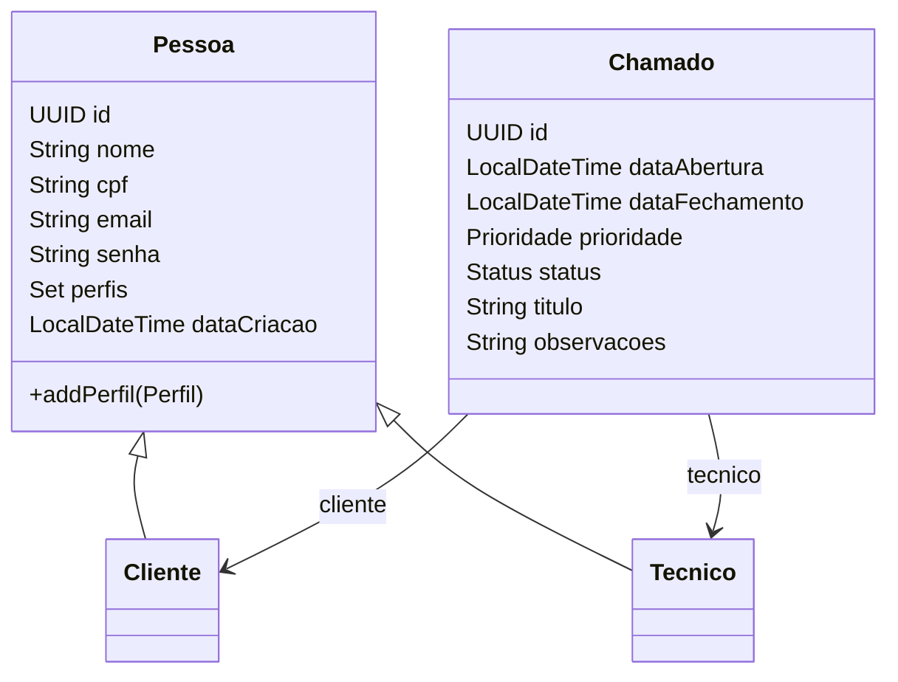

```mermaid
classDiagram
class Pessoa {
  UUID id
  String nome
  String cpf
  String email
  String senha
  Set<Perfil> perfis
  LocalDateTime dataCriacao
  +addPerfil(Perfil)
}

class Cliente
class Tecnico

Pessoa <|-- Cliente
Pessoa <|-- Tecnico

class Chamado {
  UUID id
  LocalDateTime dataAbertura
  LocalDateTime dataFechamento
  Prioridade prioridade
  Status status
  String titulo
  String observacoes
}

Chamado --> Cliente : cliente
Chamado --> Tecnico : tecnico

enum Perfil
enum Prioridade
enum Status
```