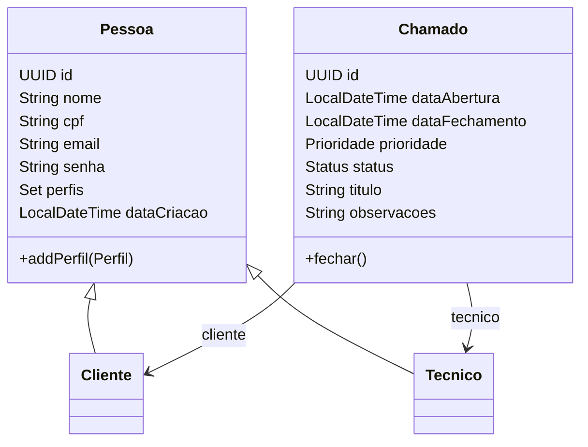

`docs/overview.md`

# Projeto Helpdesk AetherNet \- Visão Geral (MVP)

## 1\. Propósito
Fornecer um sistema de helpdesk para registro, acompanhamento e encerramento de chamados técnicos, com foco inicial em API REST (sem front\-end dedicado), priorizando clareza arquitetural, extensibilidade e entrega rápida do MVP.

## 2\. Objetivos do MVP
\- Cadastro de Cliente e Técnico  
\- Gestão de perfis (autorização futura)  
\- Abertura, atualização e encerramento de Chamados  
\- Filtros básicos (status, prioridade, técnico, cliente)  
\- Persistência JPA (H2 dev / PostgreSQL prod)  
\- Documentação básica (README + overview + diagramas)  
\- Base para evolução (segurança, relatórios, front\-end posterior)

## 3\. Escopo Funcional Inicial
### Cadastros
\- Criar / listar / obter / atualizar Cliente  
\- Criar / listar / obter / atualizar Técnico
### Chamados
\- Abrir chamado (Cliente + opcional Técnico)  
\- Atualizar status / prioridade / técnico designado  
\- Encerrar chamado (registrar data de fechamento)  
\- Consultar por filtros combinados
### Perfis
\- Perfil CLIENTE  
\- Perfil TECNICO  
\- Possível ADMIN futuro

## 4\. Requisitos Não Funcionais
\- Código limpo (nomes claros, baixa complexidade)  
\- Padrões: SOLID, MVC, separação de camadas  
\- Retornos HTTP semânticos  
\- Tratamento centralizado de erros (payload uniforme)  
\- Logs essenciais (eventos de mudança de estado em Chamados)  
\- Segurança futura (JWT / Spring Security) planejada mas não implementada no MVP  
\- Uso de UUID nas entidades  
\- Suporte à migração de banco (adicionar Flyway/Liquibase posteriormente)

## 5\. Stack Técnica
\- Linguagem: Java 17+  
\- Framework: Spring Boot  
\- Persistência: Spring Data JPA  
\- Banco dev: H2 (console habilitado)  
\- Banco prod: PostgreSQL  
\- Build: Maven  
\- Documentação API: OpenAPI/Swagger (adição pós entidades)  
\- Diagramas: Mermaid / PlantUML (code\-as\-diagram)

## 6\. Estrutura de Pacotes (Proposta)
```
com.aethernet.helpdesk
  ├─ domain
  │   ├─ enums (Perfil, Prioridade, Status)
  │   ├─ Pessoa (abstract)
  │   ├─ Cliente
  │   ├─ Tecnico
  │   └─ Chamado
  ├─ repositories
  ├─ services
  ├─ controllers
  ├─ dto
  ├─ exceptions
  ├─ config
  └─ security (posterior)
```

## 7\. Modelo de Domínio


## 8\. Estados e Regras Principais
### Status (exemplo)
\- ABERTO  
\- EM_ANDAMENTO  
\- PAUSADO  
\- ENCERRADO  
Transições válidas: ABERTO → EM_ANDAMENTO → ENCERRADO; ABERTO → PAUSADO → EM_ANDAMENTO → ENCERRADO.
### Prioridade
\- BAIXA / MEDIA / ALTA  
Pode ser ajustada até o fechamento.
### Regras
\- Chamado só é encerrado se status for atualizado para ENCERRADO (registra dataFechamento).  
\- Senha de Pessoa deve ser armazenada com hash (BCrypt) via Service.  
\- CPF único e validado (formato + dígitos).

## 9\. Endpoints Planejados (Versão Inicial)
| Método | Rota | Descrição | Status MVP |
|-------|------|-----------|------------|
| POST | /api/clientes | Criar cliente | Sim |
| GET | /api/clientes | Listar clientes | Sim |
| GET | /api/clientes/{id} | Detalhar cliente | Sim |
| PUT | /api/clientes/{id} | Atualizar cliente | Sim |
| POST | /api/tecnicos | Criar técnico | Sim |
| GET | /api/tecnicos | Listar técnicos | Sim |
| POST | /api/chamados | Abrir chamado | Sim |
| GET | /api/chamados | Listar/filtro | Sim |
| GET | /api/chamados/{id} | Detalhar | Sim |
| PATCH | /api/chamados/{id}/status | Alterar status | Sim |
| PATCH | /api/chamados/{id}/prioridade | Alterar prioridade | Sim |
| PATCH | /api/chamados/{id}/tecnico | Designar técnico | Sim |
| POST | /api/auth/login | Autenticação (futura) | Futuro |

## 10\. DTOs (Planejamento)
\- PessoaResumoDTO (id, nome, email, perfis)  
\- ClienteDTO / TecnicoDTO (campos públicos)  
\- ChamadoCreateDTO (clienteId, titulo, prioridade, observacoes, tecnicoId opcional)  
\- ChamadoUpdateDTO (prioridade?, status?, observacoes?, tecnicoId?)  
\- ChamadoViewDTO (todos os dados + nomes relacionados)

## 11\. Fluxo de Abertura de Chamado (Simplificado)
1\. Cliente envia POST /api/chamados com dados mínimos.  
2\. Service valida cliente e prioridade.  
3\. Status inicial: ABERTO; dataAbertura = now.  
4\. Persistência via ChamadoRepository.  
5\. Retorna DTO de visualização.

## 12\. Tratamento de Erros
Payload padrão:
```
{
  "timestamp": "...",
  "status": 400,
  "error": "ValidationError",
  "message": "Campo titulo obrigatório",
  "path": "/api/chamados"
}
```
Exceções customizadas:  
\- ResourceNotFoundException  
\- BusinessRuleException  
\- ValidationException

## 13\. Segurança (Planejada)
Fase 2:  
\- Inclusão de Spring Security + JWT  
\- Roles derivadas de Perfil  
\- Filtro por perfil em operações restritas (ex.: designar técnico)

## 14\. Qualidade e Boas Práticas
\- Controllers finos delegando a Services  
\- Services coesos (validação, regras)  
\- Repositórios somente persistência  
\- Uso de métodos de domínio (ex.: chamado.fechar())  
\- Evitar lógica duplicada (utilitários de validação)  
\- Testes unitários para Services principais (priorizar regras de status/prioridade)

## 15\. Backlog Inicial (Ordenado)
1\. Definir DTOs  
2\. Implementar entidades restantes (Chamado, Cliente, Tecnico)  
3\. Repositórios JPA  
4\. Services (PessoaService, ChamadoService)  
5\. Controllers REST  
6\. Tratamento de exceções global  
7\. Seed de dados dev (CommandLineRunner)  
8\. Documentação OpenAPI  
9\. Testes unitários iniciais  
10\. Logging básico  
11\. Segurança (fase posterior)

## 16\. Roadmap Macro
\- Semana 1: Planejamento, entidades, repositórios, seed  
\- Semana 2: Services + Controllers + Exceções  
\- Semana 3: Documentação OpenAPI + testes + refinamentos  
\- Semana 4: Segurança básica (se houver tempo) + ajustes finais

## 17\. Estratégia de Dados
\- H2: ddl\-auto=update, console habilitado  
\- PostgreSQL: configuração via variáveis de ambiente (URL, user, password)  
\- Futuro: Migrações versionadas (Flyway)

## 18\. Convenções
\- Nomes de pacotes: minúsculo singular  
\- DTOs terminando com sufixo DTO  
\- Commits: prefixo [feat], [fix], [docs], [refactor], [test], [chore]  
\- Branch principal: main  
\- Branches de feature: feature/descricao

## 19\. Riscos e Mitigações
\- Escopo crescer demais → focar MVP estrito  
\- Segurança tardia → planejar interfaces já preparadas para autenticação  
\- Acoplamento excessivo → manter DTOs desacoplados das entidades

## 20\. Próximos Artefatos
\- Diagrama de sequência (abertura e encerramento de chamado)  
\- Guia de erro detalhado  
\- Política de versionamento de API (v1 prefix futuro)

## 21\. Observações Finais
Esta base serve como guia inicial. Ajustes incrementais devem atualizar este arquivo e o README. Priorizar funcionalidade essencial antes de adicionar complexidade (ex.: relatórios, métricas).

---